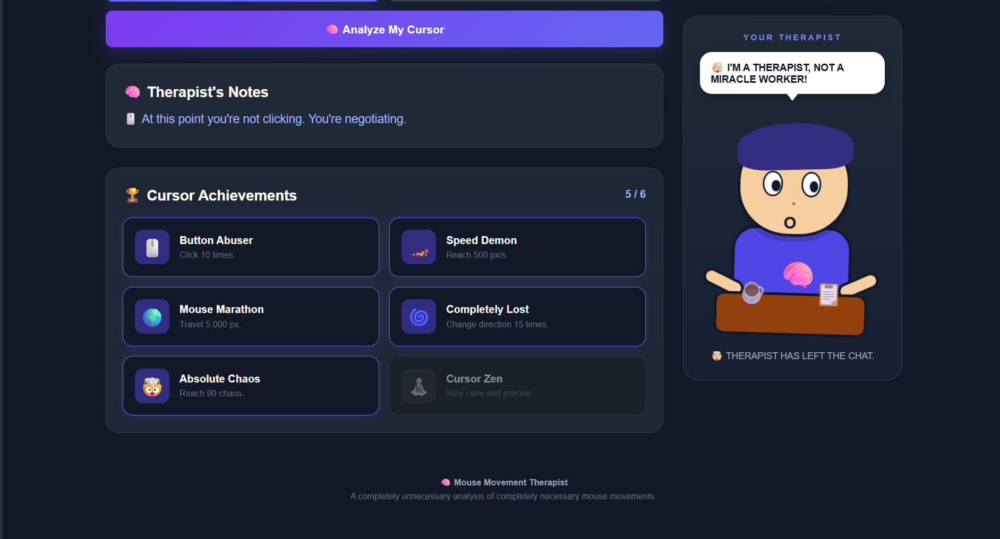
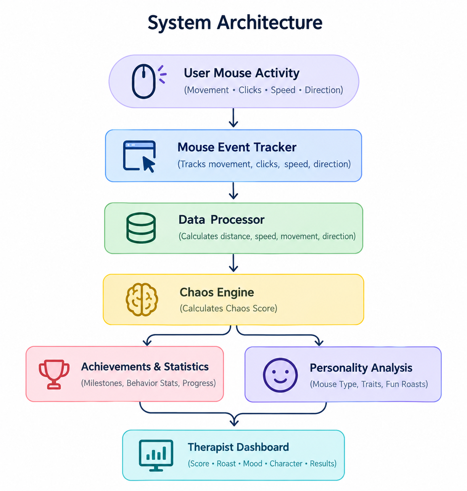

# Mouse Movement Therapist 🎯

## Basic Details
### Team Name: Builders

### Team Members
- Team Lead: Joshel Babu - Sahrdaya College of Engineering And Technology, Kodakara
- Member 2: Jovit Anto J Maliakal - Sahrdaya College of Engineering And Technology, Kodakara

### Project Description
What if your mouse had a personality and could judge you for how you use it? Mouse Movement Therapist analyzes clicks, speed, distance, and movement patterns to expose your cursor personality, chaos level, and unlock ridiculous achievements.

### The Problem (that doesn't exist)
Mouse Movement Therapist solves the completely unnecessary problem of understanding your cursor's emotional and behavioral issues by analyzing its movements, clicks, speed, and chaos level.

### The Solution (that nobody asked for)
It transforms ordinary mouse activity into a real-time behavioral diagnosis by tracking clicks, speed, distance, and direction changes to calculate a Cursor Chaos Score and personality. Instead of solving a serious problem, it turns an overlooked everyday interaction into an interactive, hilarious, and surprisingly data-driven experience.

## Technical Details
### Technologies/Components Used
For Software:
- HTML, CSS, and JavaScriptnow
- VS Code, Google Chrome, Git, and GitHub

For Hardware:
- None (software-only project)

### Implementation
For Software:
# Installation
No installation required.

# Run
Open `index.html` in Google Chrome, or run the project using VS Code's Live Server extension.

### Project Documentation
For Software:

# Screenshots (Add at least 3)

*Main Mouse Movement Therapist interface.*

*Cursor activity statistics and therapy dashboard.*

*Cursor personality and chaos analysis results.*

# Diagrams

*Workflow from mouse activity tracking to cursor personality analysis.*

For Hardware:

# Schematic & Circuit

*Add caption explaining connections*

*Add caption explaining the schematic*

# Build Photos

*List out all components shown*

*Explain the build steps*

*Explain the final build*

### Project Demo
# Video
None
*No demo video available.*

# Additional Demos
None

## Team Contributions
- Joshel Babu: Coding and searching for ideas
- Jovit Anto J Maliakal: Documentation

---
Made with ❤️ at TinkerHub Useless Projects 

